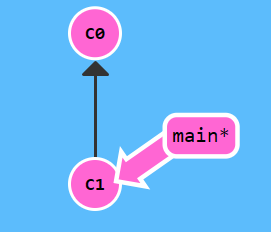
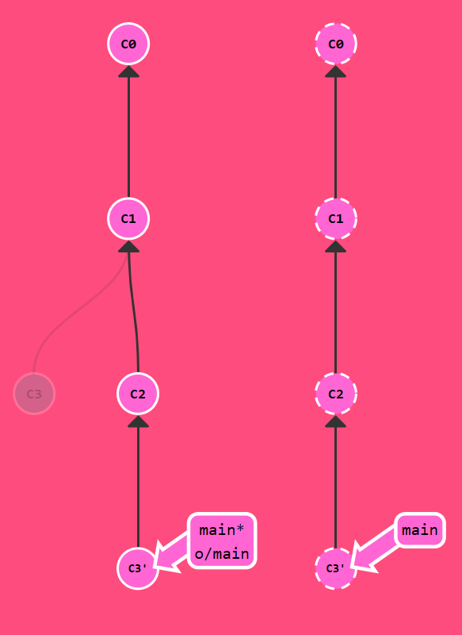
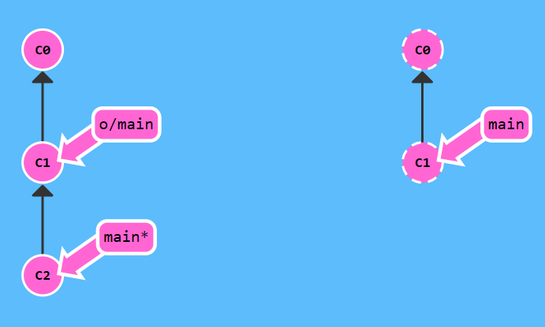
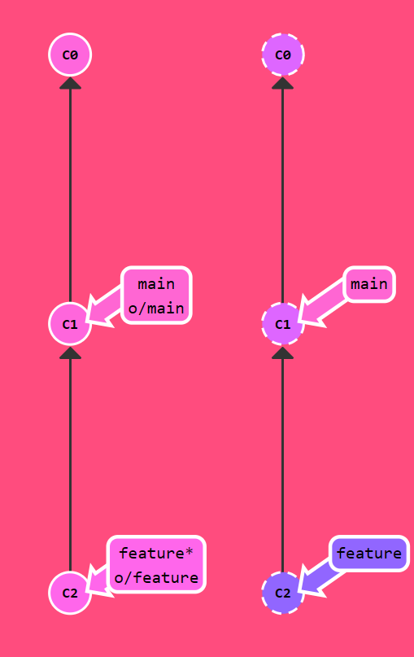

# Git理论知识

```dataview
TABLE createAt,updateAt
WHERE file = this.file
```

> [!tip] 作者说
>
>本文档是笔者基于对 [Learn Git Branching](https://learngitbranching.js.org/?locale=zh_CN) 的自主学习整理的补充性文档。如果有幸此文被您发现，强烈推荐结合 [Learn Git Branching](https://learngitbranching.js.org/?locale=zh_CN) 进行学习。
>
>由于本篇内容较多，翻看右边➡️「本页大纲」也无法做到十分清晰，因此这里提供对「二级标题」的快速索引。主体主要包括**三大部分**，如下表格所示，点击对应链接查看目标内容吧~
>
>| [1-Git 基本内容](#_1-git-基本内容) | [2-Git 远程](#_2-git-远程) | [3-实际搭配 Github 使用](#_3-实际搭配-github-使用) |
> | :------------------------: | :--------------------: | :------------------------------: |

## <span style="color:red;font-family:monospace;font-style:italic;">1</span>-Git 基本内容

### 提交

Git 仓库中的提交记录保存的是项目的目录下**所有文件的快照**，就像是把整个目录复制，然后再粘贴一样，但比复制粘贴优雅许多。

```shell [git]
git commit -m "提交描述"
```

### 分支

Git 的分支非常轻量。它们只是简单地指向**某个提交纪录** —— 仅此而已。所以许多 Git 使用者传颂：**早建分支！多用分支！**

#### 新建并切换分支

```sh [git]
git branch <分支名>   // 新建分支
git switch <分支名>   // 切换分支
```

#### 合并分支

```shell [git]
git merge <分支名>   // 把指定分支合并到当前操作的分支上
git rebase <分支名>  // 把当前操作的分支合并到指定分支上
```

### 在提交树上移动

#### HEAD

HEAD 是一个对当前所在分支的符号引用 —— 也就是指向你正在其基础上进行工作的提交记录。**HEAD 总是指向当前分支上最近一次提交记录**。大多数修改提交树的 Git 命令都是从改变 HEAD 的指向开始的。HEAD 通常情况下是指向分支名的（如 bugFix）。在你提交时，改变了 bugFix 的状态，这一变化通过 HEAD 变得可见。

原本情况下， `HEAD => [branch] => 提交记录`

```shell [git]
git checkout <提交记录hash值>
```

就变为 `HEAD => 提交记录` 。但也不难察觉，这种方式要求我们能够明确指出 `<提交记录hash值>` ，这不是一个轻松的活。所以就有了 [相对引用](#相对引用)。

#### 相对引用

正如上文所说，通过哈希值指定提交记录来移动 HEAD 很不方便，所以 Git 引入了相对引用。这个就很厉害了!

使用相对引用的话，你就可以从一个易于记忆的地方（比如 `bugFix` 分支或 `HEAD` ）开始操作。

相对引用非常给力，这里我介绍两个简单的用法：

- 使用 `^` 向上移动 1 个提交记录
- 使用 `~<num>` 向上移动多个提交记录，如 `~3`

```sh [git]
git checkout <分支名>^
git checkout <分支名>~<num>
```

#### 强制移动分支

相对引用最多的就是移动分支。可以直接使用 `-f` 选项让分支指向另一个提交。

```sh [git]
git branch -f <被移动分支> <HEAD or 分支名>~<num>
```

这一命令会将 `被移动分支` 强制指向 `HEAD or 分支名` 指向的提交记录的第 `num` 级 `parent` 提交。

#### 撤销变更

```sh [git]
git reset HEAD^  // 用于本地回滚一个版本，对远程提交无效
git revert HEAD  // 用于远程回滚。
```

我们比较常用 `git revert HEAD` ，这一命令通过新建一个「与父级提交状态相同的」提交，来**覆盖**本次提交。

### 整理提交记录

#### git cherry-pick

如果你想将一些提交复制到当前所在的位置（ `HEAD` ）下面的话， cherry-pick 是最直接的方式了。我个人非常喜欢 `cherry-pick` ，因为它特别简单。

```sh [git]
git cherry-pick <提交记录hash值1> <提交记录hash值2> ... <提交记录hash值3>
```

#### 交互式 rebase

与引入 [相对引用](#相对引用) 的原因相同，我们有时候并不知道**提交记录 hash 值**，这时我们就可以使用 交互式 rebase。

交互式 rebase 指的是使用带参数 `--interactive` 的 rebase 命令, 简写为 `-i` 。

如果你在命令后增加了这个选项, Git 会打开一个 UI 界面并列出将要被复制到目标分支的备选提交记录，它还会显示每个提交记录的哈希值和提交说明，提交说明有助于你理解这个提交进行了哪些更改。

在实际使用时，所谓的 UI 窗口一般会在文本编辑器 —— 如 Vim —— 中打开一个文件。 

```sh [git]
git rebase -i HEAD~<num>
```

这一命令表明：将通过 UI 调整 `HEAD` 第 `<num>` 级 `parent` 提交记录 **以下的** 提交记录。

### 提交的技巧

#### 技巧 1

接下来这种情况也是很常见的：你之前在 `newImage` 分支上进行了一次提交，然后又基于它创建了 `caption` 分支，然后又提交了一次。

此时你想对某个以前的提交记录进行一些小小的调整。比如设计师想修改一下 `newImage` 中图片的分辨率，尽管那个提交记录并不是最新的了。

我们可以通过下面的方法来克服困难：

- 先用 `git rebase -i HEAD~<num>` 将提交重新排序，然后把我们**想要修改的提交记录**挪到最前
- 然后用 `git commit --amend` 来进行一些小修改
- 接着再用 `git rebase -i HEAD~<num>` 来将他们调回原来的顺序
- 最后我们把 main 移到修改的最前端（详见 [强制移动分支](#强制移动分支)），就大功告成啦！

#### 技巧 2

主要是通过 [git cherry-pick](#git%20cherry-pick) 和 [强制移动分支](#强制移动分支) 进行多次提交

### Git tags

`tag` 用来永远指向某个提交记录。

```sh [git]
git tag <标签值> <提交记录hash值>or<相对引用>
```

### Git describe

```sh [git]
git describe <ref>
```

`<ref>` 是任何能被 Git 识别成提交记录的引用，如果你没有指定的话，Git 会使用你目前所在的位置（ `HEAD` ）。

它输出的结果是这样的：

`<tag>_<numCommits>_g<hash>`

`tag` 表示的是离 `ref` 最近的标签， `numCommits` 是表示这个 `ref` 与 `tag` 相差有多少个提交记录， `hash` 表示的是你所给定的 `ref` 所表示的提交记录哈希值的前几位。

当 `ref` 提交记录上有某个标签时，则只输出标签名称。

## <span style="color:red;font-family:monospace;font-style:italic;">2</span>-Git 远程

::: info 远程仓库

即本地仓库的内容在远程的备份，实现了代码社交化。

:::

### git clone

用此命令，把「远程仓库」克隆到「本地仓库」，方便我们对仓库进行修改、PR……

```sh [git]
git clone git@github.com:<username>/<repo-name>.git
```

### git fetch

`git fetch` 完成了仅有的但是很重要的两步:

- 从远程仓库下载本地仓库中缺失的提交记录
- 更新远程分支指针(如 `o/main`)

`git fetch` 实际上将本地仓库中的「远程分支」更新成了「远程仓库相应分支」最新的状态，但并不会改变本地仓库的状态。它不会更新你的 `main` 分支，也不会修改你磁盘上的文件。

理解这一点很重要，因为许多开发人员误以为执行了 `git fetch` 以后，他们本地仓库就与远程仓库同步了。它可能已经将进行这一操作所需的所有数据都下载了下来，但是**并没有**修改你本地的文件。

### git pull

`git pull` 完成了「先抓取更新再合并到本地分支」这两个操作。

### git push

`git push` 负责将**你的**变更上传到指定的远程仓库，并在远程仓库上合并你的新提交记录。

### 偏离的提交历史

假设你周一克隆了一个仓库，然后开始研发某个新功能。到周五时，你新功能开发测试完毕，可以发布了。但是你发现你的同事这周写了一堆代码，还改了许多你的功能中使用的 API，这些变动会导致你新开发的功能变得不可用。但是他们已经将那些提交推送到远程仓库了，因此你的工作就变成了基于项目**旧版**的代码，与远程仓库最新的代码不匹配了。

这种情况下, 因为这情况（历史偏离）有许多的不确定性，Git 是不会允许你 `push` 变更的。实际上 `git push` 会**强制你先合并远程最新的代码**，然后才能分享你的工作。

|                初始状态                |               目标状态               |
| :--------------------------------: | :------------------------------: |
|  |  |

```sh [git]
git clone
git fakeTeamwork  // learngitbranching网站自定义命令，模拟团队协作
git commit
git pull --rebase
git push
```

运行过程如下


### 远程服务器拒绝

如果你是在一个大的合作团队中工作，很可能是 main 被锁定了，需要一些 Pull Request 流程来合并修改。如果你直接提交 (commit) 到本地 main，然后试图推送 (push) 修改, 你将会收到这样类似的信息：

```sh [powershell]
! [远程服务器拒绝] main -> main (TF402455: 不允许推送(push)这个分支; 你必须使
用pull request来更新这个分支.)
```

|                  初始状态                  |                目标状态                |
| :------------------------------------: | :--------------------------------: |
|  |  |

```sh [git]
git branch -f main o/main
git branch feature C2
git switch feature
git push
```

运行过程如下

