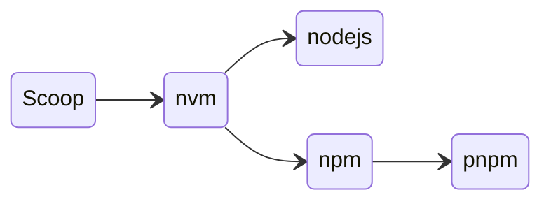
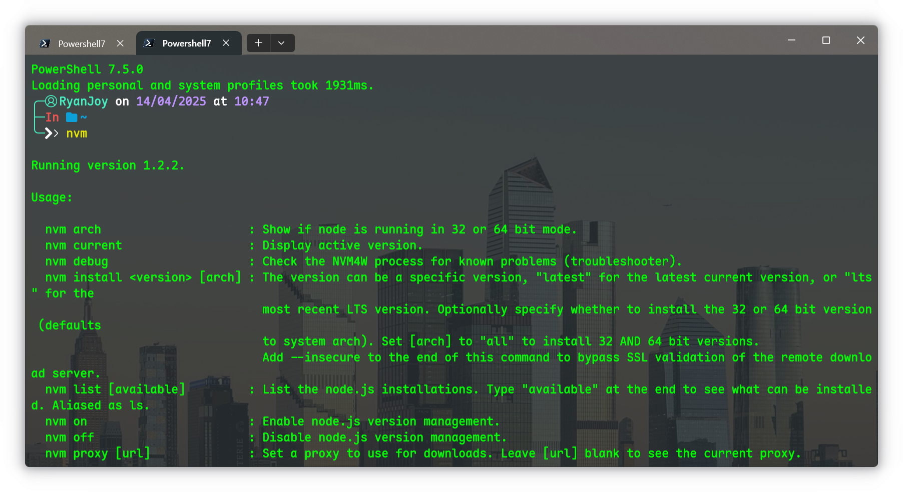
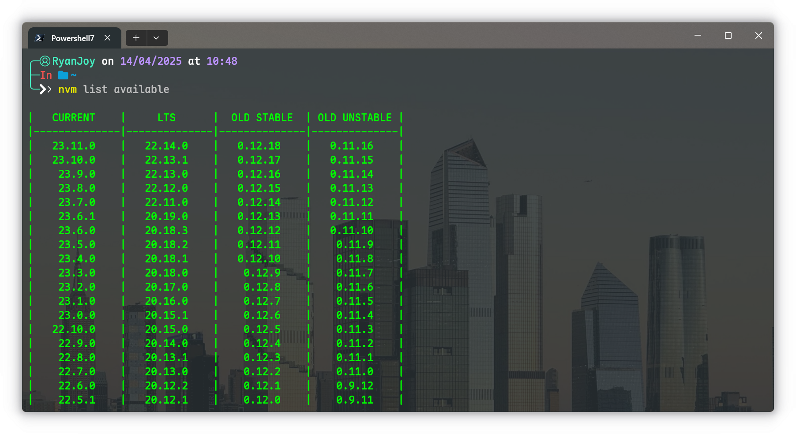
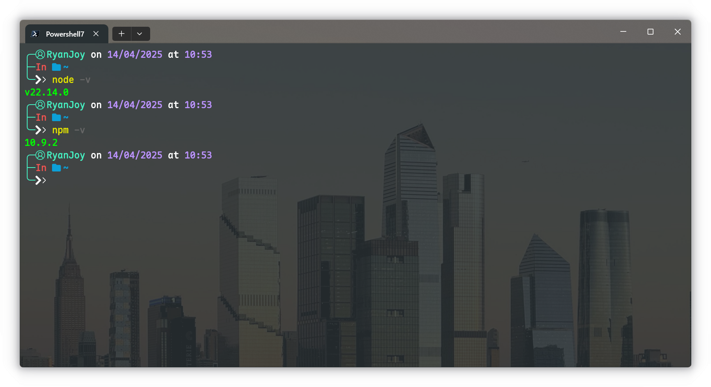
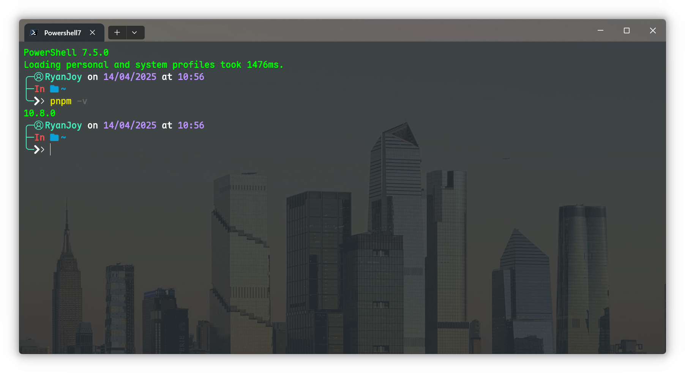

# Npm&Pnpm的安装与配置

::: tip 作者说

在看本篇之前，您最好已经完成了 [Scoop——Windows下的包管理器](../../🛠️实用工具/📦Scoop/Scoop——Windows下的包管理器.md) 的阅读和实践

:::

总体思路如下：使用 `scoop` 管理 `nvm` ，使用 `nvm` 管理 `nodejs` 和 `npm` ，使用 `npm` 安装 `pnpm` 。



##  `nvm` 的安装

```sh [powershell]
scoop install nvm
```

安装完毕后进行验证，出现下图即为安装成功



##  `nodejs` 安装

查询可用版本

```sh [powershell]
nvm list available
```



安装指定版本并使用

```sh [powershell]
nvm install 22.14.0
nvm use 22.14.0
```

验证安装

```sh [powershell]
node -v
npm -v
```



##  `npm` 镜像配置

```sh [powershell]
npm config set registry https://registry.npmmirror.com
```

##  `pnpm` 安装

```sh [powershell]
npm install -g pnpm
```

验证安装



镜像配置

```sh [powershell]
pnpm set registry https://registry.npmmirror.com
```

初始化 `pnpm`

```sh [powershell]
pnpm setup
```

此命令会自动设置好所有的环境变量、安装目录等，如果你有自定义的需要，可以参考下述命令

```sh [powershell]
# 允许设置全局安装包的 bin 文件的目标目录。
pnpm config set global-bin-dir "[自定义绝对路径]"
# 包元数据缓存的位置。
pnpm config set cache-dir "[自定义绝对路径]"
# pnpm 创建的当前仅由更新检查器使用的 pnpm-state.json 文件的目录。
pnpm config set state-dir "[自定义绝对路径]"
# 指定储存全局依赖的目录。
pnpm config set global-dir "[自定义绝对路径]"
# 所有包被保存在磁盘上的位置。
pnpm config set store-dir "[自定义绝对路径]"
```