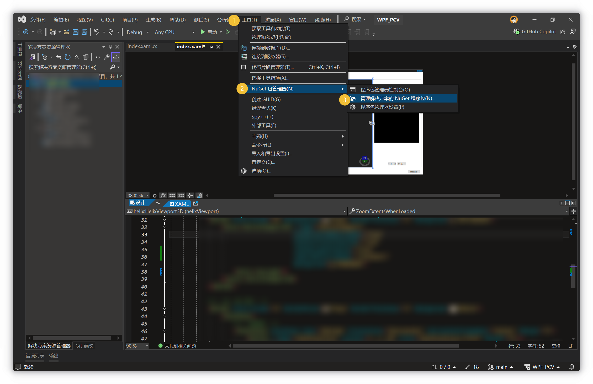
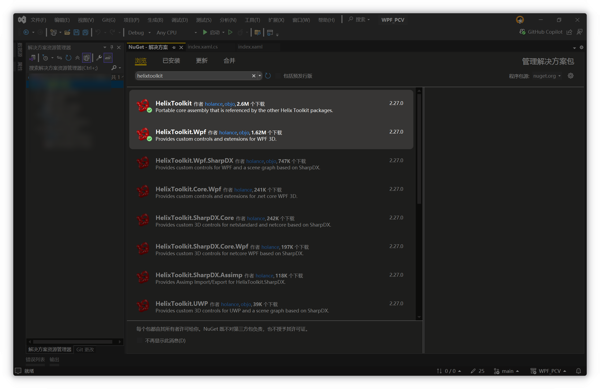
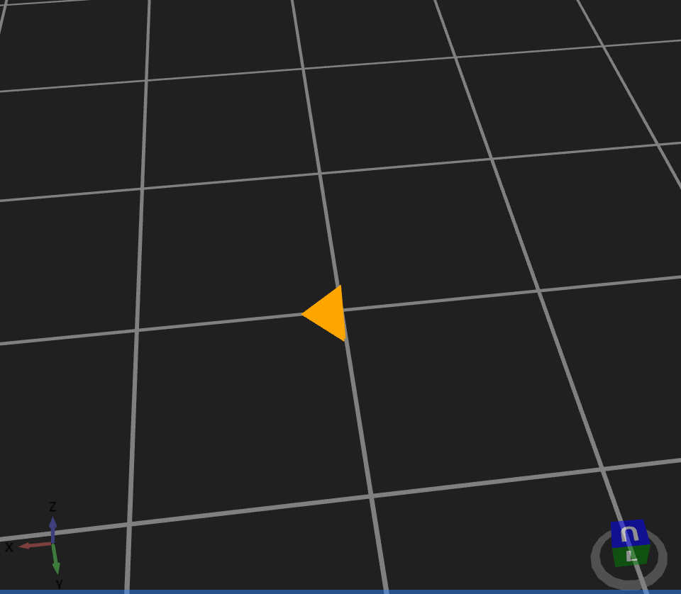
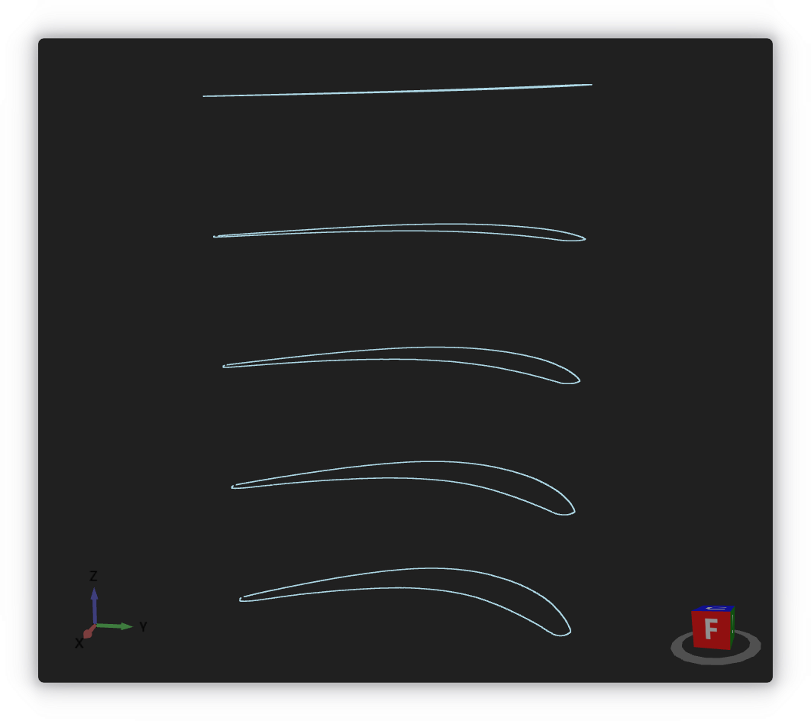

# HelixToolkit.Wpf中文文档

## 项目前期准备

- **安装包**：在 Visual Studio 中为 .NET Framework 4.8 的 WPF 项目安装 `HelixToolkit.Wpf` NuGet 包。该包提供了丰富的 3D 控件和辅助类，是基于 WPF 3D（ `Media3D` ）的扩展。
	打开 NuGet 依赖包管理器 
	安装两个依赖包 
- **命名空间**：安装后，在 XAML 根元素（如 `<Window>`）中添加 HelixToolkit 的命名空间声明，例如：

	```xml
	xmlns:helix="clr-namespace:HelixToolkit.Wpf;assembly=HelixToolkit.Wpf"
	```

	这样即可在 XAML 中使用 `<helix:HelixViewport3D>` 等控件。

- **示例 XAML**：以下示例演示了基本的窗口结构和 `HelixViewport3D` 控件：

    ```xml
    <Window x:Class="HelixDemo.MainWindow" 
            xmlns="http://schemas.microsoft.com/winfx/2006/xaml/presentation"
            xmlns:x="http://schemas.microsoft.com/winfx/2006/xaml"
            xmlns:helix="clr-namespace:HelixToolkit.Wpf;assembly=HelixToolkit.Wpf"
            Title="HelixToolkit 示例" Height="450" Width="800">
        <Grid>
            <helix:HelixViewport3D x:Name="viewport" ZoomExtentsWhenLoaded="True">
                <!-- 在这里添加灯光和3D模型 -->
            </helix:HelixViewport3D>
        </Grid>
    </Window>
    ```

    安装好包并配置命名空间后，核心控件 `HelixViewport3D` 就可以在 XAML 中使用了。

## XAML 前端控件使用教程

### HelixViewport 3D 基本使用

`HelixViewport3D` 是承载所有 `3D` 内容的视口控件，包含了**内置的相机控制器(CameraController)**。常用属性包括： `CameraMode` （相机模式，如 Inspect、FixedPosition 等）、 `CameraRotationMode` （旋转方式，如 Trackball、Turntable）、 `ZoomExtentsWhenLoaded` （加载时自动缩放以适应所有模型）、 `ShowCoordinateSystem` / `ShowViewCube` （显示坐标轴和视图立方体）等。例如：

```xml
<helix:HelixViewport3D CameraMode="Inspect" ShowViewCube="True" ShowCoordinateSystem="True" ZoomExtentsWhenLoaded="True">
    <!-- 默认灯光 -->
    <helix:DefaultLights/>
    <!-- 网格参考线 -->
    <helix:GridLinesVisual3D Width="10" Length="10" MajorDistance="1" MinorDistance="0.25" Thickness="0.02"/>
</helix:HelixViewport3D>
```

在上例中， `HelixViewport3D` 会显示一个可旋转、可缩放的 `3D` 视图窗口，并自动添加默认灯光。属性 `ZoomExtentsWhenLoaded="True"` 会在内容加载时自动缩放到合适视图。

### HelixViewport3D 内部可用子标签

```xml
<helix:HelixViewport3D>
  <!-- 摄像机定义 -->
  <helix:HelixViewport3D.Camera>
    <!-- PerspectiveCamera 或 OrthographicCamera -->
  </helix:HelixViewport3D.Camera>

  <!-- 灯光 -->
  <helix:DefaultLights/>
  <helix:SunLight …/>
  <AmbientLight …/>
  <PointLight …/>
  <DirectionalLight …/>
  <SpotLight …/>

  <!-- 3D 几何体控件（Visual3D 系列） -->
  <helix:BoxVisual3D …/>
  <helix:CubeVisual3D …/>
  <helix:SphereVisual3D …/>
  <helix:CylinderVisual3D …/>
  <helix:TorusVisual3D …/>
  <helix:TruncatedConeVisual3D …/>
  <helix:TubeVisual3D …/>
  <helix:GridLinesVisual3D …/>
  <helix:LinesVisual3D …/>
  <helix:PointsVisual3D …/>
  <helix:BillboardTextVisual3D …/>
  <helix:MeshGeometryVisual3D …/>
  <ModelVisual3D …/>

  <!-- 数据驱动模板 -->
  <helix:ItemsVisual3D ItemsSource="{Binding …}">
    <helix:DataTemplate3D>
      <!-- 绑定到具体 Visual3D -->
    </helix:DataTemplate3D>
  </helix:ItemsVisual3D>
</helix:HelixViewport3D>
```

### 相机设置

可在其中放入 `PerspectiveCamera`（透视相机）或 `OrthographicCamera` （正交相机） 标签。

```xml
<helix:HelixViewport3D>
  <helix:HelixViewport3D.Camera>
    <PerspectiveCamera 
      Position="0,0,5" 
      LookDirection="0,0,-1" 
      UpDirection="0,1,0" 
      FieldOfView="45"
      NearPlaneDistance="0.1"
      FarPlaneDistance="1000"/>
  </helix:HelixViewport3D.Camera>
</helix:HelixViewport3D>
```

| 属性                    | 含义      | 格式 / 示例            |
| :---------------------: | :-------: | :------------------: |
| **Position**          | 相机所在位置  | `x,y,z` — `0,0,5`  |
| **LookDirection**     | 相机朝向矢量  | `x,y,z` — `0,0,-1` |
| **UpDirection**       | 相机“上”方向 | `x,y,z` — `0,1,0`  |
| **FieldOfView**       | 视野角度（度） | `double` — `45`    |
| **NearPlaneDistance** | 最近裁剪面   | `double` — `0.1`   |
| **FarPlaneDistance**  | 最远裁剪面   | `double` — `1000`  |

> [!Tip]
> 对于 **工业模型** 来说，建议使用 `OrthographicCamera` 进行。虽然 `PerspectiveCamera` 更加符合现实情况，但是我们在计算机中对工业模型进行预览时，需要的是精确的对比和数据效果，此时“近大远小”的特性反而会影响我们的判断。

### 灯光设置

|            标签            |                                                 常用属性                                                  |                                                    示例                                                     |
| :----------------------: | :---------------------------------------------------------------------------------------------------: | :-------------------------------------------------------------------------------------------------------: |
| `<helix:DefaultLights/>` |                                      一次性添加一组默认灯光（头灯 + 环境光 + 定向光）                                      |                                         `<helix:DefaultLights/>`                                          |
|    `<helix:SunLight>`    |                                  `Color` 、 `Direction` 、 `Intensity`                                  |                    `<helix:SunLight Color="White" Direction="0,-1,0" Intensity="1"/>`                     |
|     `<AmbientLight>`     |                                                `Color`                                                |                                     `<AmbientLight Color="#404040"/>`                                     |
|      `<PointLight>`      | `Color` 、 `Position` 、 `Range` 、 `ConstantAttenuation` 、 `LinearAttenuation` 、 `QuadraticAttenuation` |                        `<PointLight Color="Yellow" Position="0,5,0" Range="20"/>`                         |
|   `<DirectionalLight>`   |                                         `Color` 、 `Direction`                                         |                         `<DirectionalLight Color="White" Direction="-1,-1,-1"/>`                          |
|      `<SpotLight>`       |          `Color` 、 `Position` 、 `Direction` 、 `InnerConeAngle` 、 `OuterConeAngle` 、 `Range`           | `<SpotLight Color="White" Position="0,5,5" Direction="0,-1,-1" InnerConeAngle="20" OuterConeAngle="30"/>` |

### 几何体控件

#### 长方体 `BoxVisual3D`

```xml
<helix:BoxVisual3D
  Width="2" Height="1" Length="1"
  Center="0,0,0"
  Fill="LightBlue"/>
```

|属性|含义|格式 / 示例|
|:---:|:---:|:---:|
|Width|X 轴尺寸|`double`|
|Height|Y 轴尺寸|`double`|
|Length|Z 轴尺寸|`double`|
|Center|中心点坐标|`x,y,z`|
|Fill|填充画刷|`Brush`|

#### 立方体 `CubeVisual3D`

```xml
<helix:CubeVisual3D SideLength="2" Center="1,0,0" Fill="LightGreen"/>
```

|属性|含义|示例|
|:---:|:---:|:---:|
|SideLength|边长|`2`|
|Center|中心坐标|`1,0,0`|
|Fill|填充画刷|`Green`|

#### 球体 `SphereVisual3D`

```xml
<helix:SphereVisual3D Radius="1" Center="-2,0,0" ThetaDiv="32" PhiDiv="16" Fill="Tomato"/>
```

|属性|含义|示例|
|:---:|:---:|:---:|
|Radius|半径|`1`|
|Center|中心坐标|`-2,0,0`|
|ThetaDiv|水平细分数（经度）|`32`|
|PhiDiv|垂直细分数（纬度）|`16`|
|Fill|填充画刷|`Tomato`|

#### 圆柱体 `CylinderVisual3D`

```xml
<helix:CylinderVisual3D Height="3" Diameter="1" Origin="0,0,0" Direction="0,1,0" ThetaDiv="36" Fill="Orange"/>
```

|属性|含义|示例|
|:---:|:---:|:---:|
|Height|高度|`3`|
|Diameter|直径|`1`|
|Origin|底面中心坐标|`0,0,0`|
|Direction|轴向|`0,1,0`|
|ThetaDiv|圆周细分数|`36`|
|Fill|填充画刷|`Orange`|

#### 环面 `TorusVisual3D`

```xml
<helix:TorusVisual3D TorusDiameter="3" TubeDiameter="0.5" ThetaDiv="64" PhiDiv="16" Fill="Gold"/>
```

|属性|含义|示例|
|:---:|:---:|:---:|
|TorusDiameter|环面直径|`3`|
|TubeDiameter|管径|`0.5`|
|ThetaDiv|环向细分|`64`|
|PhiDiv|管向细分|`16`|
|Fill|填充画刷|`Gold`|

#### 截锥体 `TruncatedConeVisual3D`

```xml
<helix:TruncatedConeVisual3D BaseRadius="1" TopRadius="0.3" Height="2" Origin="0,0,0" BaseCap="True" TopCap="False" Fill="Teal"/>
```

|属性|含义|示例|
|:---:|:---:|:---:|
|BaseRadius|底面半径|`1`|
|TopRadius|顶面半径|`0.3`|
|Height|高度|`2`|
|Origin|原点（底面中心）|`0,0,0`|
|BaseCap|底面封闭|`True`|
|TopCap|顶面封闭|`False`|
|Fill|填充画刷|`Teal`|

#### 管道 `TubeVisual3D`

```xml
<helix:TubeVisual3D
  Path="-1,0,0  1,0,0  1,1,0" 
  Diameter="0.1" 
  ThetaDiv="16"
  Fill="HotPink"/>
```

|属性|含义|示例|
|:---:|:---:|:---:|
|Path|点列表（空格分隔）|`-1,0,0 1,0,0 1,1,0`|
|Diameter|管径|`0.1`|
|ThetaDiv|环向细分|`16`|
|Fill|填充画刷|`HotPink`|

#### 网格线 `GridLinesVisual3D`

```xml
<helix:GridLinesVisual3D
  Width="20" Length="20"
  MajorDistance="1" MinorDistance="5"
  Thickness="0.02"
  Color="Gray"/>
```

|      属性       |  含义   |   示例   |
| :-----------: | :---: | :----: |
|     Width     | X 轴范围 |  `20`  |
|    Length     | Y 轴范围 |  `20`  |
| MajorDistance | 主网格间距 |  `1`   |
| MinorDistance | 次网格间距 |  `5`   |
|   Thickness   |  线宽   | `0.02` |
|     Color     |  线颜色  | `Gray` |

#### 折线 `LinesVisual3D`

```xml
<helix:LinesVisual3D
  Points="0,0,0 1,0,0 1,1,0"
  Color="Blue"
  Thickness="0.01"/>
```

|属性|含义|示例|
|:---:|:---:|:---:|
|Points|点列表（空格分隔）|`0,0,0 1,0,0 1,1,0`|
|Color|线颜色|`Blue`|
|Thickness|线宽|`0.01`|

#### 散点 `PointsVisual3D`

```xml
<helix:PointsVisual3D
  Points="0,0,0 1,1,1 2,0,2"
  Color="Red"
  Size="6"/>
```

|属性|含义|示例|
|:---:|:---:|:---:|
|Points|点列表|`0,0,0 1,1,1 2,0,2`|
|Color|点颜色|`Red`|
|Size|点大小|`6`|

#### 平面文字 `BillboardTextVisual3D`

```xml
<helix:BillboardTextVisual3D
  Position="0,2,0"
  Text="Hello 3D"
  FontSize="24"
  Foreground="Black"
  Background="White"/>
```

|属性|含义|示例|
|:---:|:---:|:---:|
|Position|文字位置|`0,2,0`|
|Text|文本内容|`"Hello 3D"`|
|FontSize|字号|`24`|
|Foreground|字体颜色|`Black`|
|Background|背景颜色|`White`|

#### 自定义网格 `MeshGeometryVisual3D`

```xml
<helix:MeshGeometryVisual3D
  Mesh="{Binding MyMesh}"
  Material="{Binding MyMaterial}"
  BackMaterial="{Binding MyBackMaterial}"/>
```

|属性|含义|示例|
|:---:|:---:|:---:|
|Mesh|`MeshGeometry3D` 对象|`{Binding MyMesh}`|
|Material|正面材质（`Material`）|`{Binding MyMaterial}`|
|BackMaterial|背面材质|`{Binding MyBackMaterial}`|

#### 任意 Model 3D `ModelVisual3D`

```xml
<ModelVisual3D>
  <ModelVisual3D.Content>
    <GeometryModel3D …/>
  </ModelVisual3D.Content>
</ModelVisual3D>
```

- **Content**：可放入任意 `Model3D` （如 `GeometryModel3D` 、 `Model3DGroup` 等）

可以在 XAML 中直接定义自定义网格（ `MeshGeometry3D` ）来绘制任意模型。例如：

```xml
<ModelVisual3D>
  <ModelVisual3D.Content>
    <GeometryModel3D>
      <GeometryModel3D.Geometry>
        <MeshGeometry3D 
          Positions="0 0 0  1 0 0  0 1 0  0 0 1" 
          TriangleIndices="0 1 2  0 2 3  0 3 1  1 2 3" />
      </GeometryModel3D.Geometry>
      <GeometryModel3D.Material>
        <DiffuseMaterial Brush="Orange"/>
      </GeometryModel3D.Material>
    </GeometryModel3D>
  </ModelVisual3D.Content>
</ModelVisual3D>
```

上例中， `Positions` 和 `TriangleIndices` 指定了自定义网格的顶点和三角形索引。这种方式适用于简单模型；对于复杂网格，可以使用 HelixToolkit 的 `MeshBuilder` 在后台生成网格。



### 数据驱动模板

`ItemsVisual3D` + `DataTemplate3D`

```xml
<helix:ItemsVisual3D ItemsSource="{Binding MyModels}">
  <helix:DataTemplate3D>
    <helix:CubeVisual3D 
      Center="{Binding Position}" 
      SideLength="{Binding Size}"
      Fill="{Binding Color}"/>
  </helix:DataTemplate3D>
</helix:ItemsVisual3D>
```

|       属性       |          含义           |          示例          |
| :------------: | :-------------------: | :------------------: |
|  ItemsSource   |     可枚举数据源（模型列表）      | `{Binding MyModels}` |
| DataTemplate3D | 定义单项渲染模板（Visual3D 元素） |   包含一段 Visual3D 标签   |

## 常用 `XAML` 控件属性汇总表

下面列出常见 `HelixToolkit 3D` 控件及其常用属性（用途示例）。使用时可在 XAML 中直接设置这些属性。

|             控件             |                                                                                             常用属性及含义                                                                                             |                                                                                                                                                                               示例用法                                                                                                                                                                                |
| :------------------------: | :---------------------------------------------------------------------------------------------------------------------------------------------------------------------------------------------: | :---------------------------------------------------------------------------------------------------------------------------------------------------------------------------------------------------------------------------------------------------------------------------------------------------------------------------------------------------------------: |
|   **HelixViewport 3 D**    | `CameraMode` （相机模式，如 Inspect、FixedPosition、WalkAround）<br>`CameraRotationMode` （旋转模式，如 Trackball）<br>`ZoomExtentsWhenLoaded` （加载时自动缩放）<br>`ShowCoordinateSystem` / `ShowViewCube` （显示坐标系和视图立方体） | `<helix:HelixViewport3D x:Name="helixViewport" CameraMode="WalkAround" ZoomExtentsWhenLoaded="True" ShowCoordinateSystem="True" ShowViewCube="True" IsHeadLightEnabled="True" CameraRotationMode="Turntable" Background="#202020" ZoomRectangleCursor="ScrollSE" ZoomCursor="SizeNS" RotateCursor="SizeAll" PanCursor="Hand" ChangeFieldOfViewCursor="ScrollNS">` |
|    **CameraController**    |                                    相机控制器（通常内嵌在 HelixViewport 3 D 中，不需要直接使用）<br>属性包括： `CameraPosition` 、 `CameraLookDirection` 、 `CameraUpDirection` 、灵敏度等设置                                     |                                                                                                                                                                          通常不直接在 XAML 中使用                                                                                                                                                                          |
|      **BoxVisual 3D**      |                                                             `Width` / `Height` / `Length` ：长方体尺寸<br>`Center` ：中心位置<br>`Fill` ：填充画刷                                                              |                                                                                                                                         `<helix:BoxVisual3D Width="2" Height="1" Length="1" Center="0,0,0" Fill="Blue"/>`                                                                                                                                         |
|     **CubeVisual 3D**      |                                                                      `SideLength` ：立方体边长<br>`Center` ：中心位置<br>`Fill` ：填充画刷                                                                      |                                                                                                                                                `<helix:CubeVisual3D SideLength="2" Center="0,0,0" Fill="Green"/>`                                                                                                                                                 |
|    **SphereVisual 3D**     |                                                                 `Radius` ：半径<br>`Center` ：中心位置<br>`ThetaDiv` / `PhiDiv` ：经纬度细分                                                                  |                                                                                                                                                  `<helix:SphereVisual3D Radius="1" Center="0,0,0" Fill="Red"/>`                                                                                                                                                   |
|     **TorusVisual 3D**     |                                                            `TorusDiameter` ：环面直径<br>`TubeDiameter` ：管径<br>`ThetaDiv` / `PhiDiv` ：细分                                                             |                                                                                                                                             `<helix:TorusVisual3D TorusDiameter="3" TubeDiameter="1" Fill="Orange"/>`                                                                                                                                             |
| **TruncatedConeVisual 3D** |                                                  `BaseRadius` / `TopRadius` ：底/顶半径<br>`Height` / `Origin` ：高度与原点<br>`BaseCap` / `TopCap` ：是否封闭                                                  |                                                                                                                               `<helix:TruncatedConeVisual3D BaseRadius="1" TopRadius="0.5" Height="2" Origin="0,0,0" Fill="Gold"/>`                                                                                                                               |
|     **TubeVisual 3D**      |                                                                      `Path` ：路径点集合<br>`Diameter` ：直径<br>`ThetaDiv` ：管道环向细分                                                                      |                                                                                                                                            `<helix:TubeVisual3D Path="-1 0 0  1 0 0" Diameter="0.1" Fill="HotPink"/>`                                                                                                                                             |
|   **GridLinesVisual 3D**   |                                                    `Width` / `Length` ：网格范围<br>`MajorDistance` / `MinorDistance` ：主/次网格间距<br>`Thickness` ：线宽                                                    |                                                                                                                                     `<helix:GridLinesVisual3D Width="10" Length="10" MajorDistance="1" MinorDistance="0.2"/>`                                                                                                                                     |
|     **LinesVisual 3D**     |                                                                       `Points` ：连接的点集合<br>`Color` ：颜色<br>`Thickness` ：线宽                                                                        |                                                                                                                                       `<helix:LinesVisual3D Points="{Binding LinePoints}" Color="Blue" Thickness="0.01"/>`                                                                                                                                        |
|    **PointsVisual 3D**     |                                                                           `Points` ：点集合<br>`Color` ：颜色<br>`Size` ：点大小                                                                           |                                                                                                                                             `<helix:PointsVisual3D Points="{Binding Points}" Color="Red" Size="6"/>`                                                                                                                                              |
| **BillboardTextVisual 3D** |                                                              `Text` ：文字内容<br>`Position` ：位置<br>`FontSize` / `Foreground` ：字体大小与颜色                                                               |                                                                                                                                  `<helix:BillboardTextVisual3D Position="0,5,0" Text="Hello" FontSize="24" Foreground="Black"/>`                                                                                                                                  |

> **注：** 表中控件属性为常用的部分示例，完整属性列表可参考 HelixToolkit 文档。例如， `CameraController` 还有大量相机操作属性；材质和光照配置可用 WPF 的 `<DiffuseMaterial>` 、 `<SpecularMaterial>` 等结合 HelixToolkit 的 `MaterialHelper` 使用。

### 区分 `CareraMode` 的三属性

下面用最通俗的比喻示例，来说明 `HelixToolkit.Wpf` 中三种摄像机模式的区别（ `Insect` 、 `FixedPosition` 、 `WalkAround` ）。

#### 1. `FixedPosition` —— **固定相机，旋转场景**

你就像坐在电影院的座位上，不能动位置，只能转头去看屏幕的不同部分。

- **相机位置不会动**，始终固定在原地；
- 拖动画面时，其实是**旋转整个场景**，而不是你自己动；
- 场景像在你眼前转动，而你原地不动。

#### 2. `Inspect` —— **原地观察目标**

你像拿着一个摄影机围着一个雕像绕圈拍照，但你永远面朝它（就像用转盘转模型一样）。

- **相机始终绕着目标物旋转**，焦点不动；
- 可以拖拽旋转场景（围绕中心点旋转）；
- 可放大缩小（拉近拉远焦点）；
- 类似“轨道模式”或“环绕观察”。

#### 3. `WalkAround` —— **第一人称行走视角**

你像是玩第一人称游戏（比如 Minecraft、CSGO），可以在场景里自由走动，并左右看看。

- 鼠标左键：**默认禁用**
- 鼠标右键：**控制方向（相机转头）**
- 鼠标滚轮：**向前/向后平移**
- 鼠标中键：**平移（侧向移动）**
- 键盘方向键：可移动相机位置（前后左右）
- **相机会真正“移动”位置，而不是只旋转视角**；
- 更真实的“在场景中穿行”体验。

#### 总结对比表

|      模式名      |      用户行为感受       | 相机位置 |  相机朝向   |    常见用途     |
| :-----------: | :---------------: | :--: | :-----: | :---------: |
| `FixedPosition` |    原地不动，只能旋转场景    |  固定  | 跟随拖拽改变  |   静态查看、展示   |
|    `Inspect`   |   相机绕目标转，始终盯着焦点   | 自动旋转 | 始终面向中心点 | 模型查看器、3D 展示 |
| `WalkAround`  | 第一人称行走，像在 FPS 游戏中 | 可移动  |  可自由控制  |  室内漫游、场景漫游  |

### 区分 `CameraRotationMode` 的三属性

下面用最通俗的比喻示例，来说明 `HelixToolkit.Wpf` 中三种摄像机旋转模式的区别（ `Turntable` 、 `Turnball` 、 `Trackball` ）。但在之前，我们需要明确初始坐标轴



我们习惯这样定义三个轴：

- X 轴：垂直于屏幕（即我们的**视线方向**），并且从屏幕指向我们为正向
- Y 轴：水平方向，并且从左向右为正向
- Z 轴：垂直于 XOY 平面，并且自下向上为正向

> [!tip] 注意
> 在之后的探讨分析中，我们默认三个轴的方向在初始情况始终满足我们的定义

#### 唱盘式 `Turntable`

- **比喻**：就像一张黑胶唱片在桌子上转动，你只能左右转动唱片，也可以上下“抬头/低头”去看唱片边缘，但唱片永远不会“侧翻”或“滚动”——地平线始终水平。
- **效果**：
    - **水平拖拽** → 绕垂直（Z）轴旋转（偏航， `yaw` ）
    - **垂直拖拽** → 绕水平（Y）轴倾斜（俯仰， `pitch` ）
    - **不支持绕视线方向（X 轴）的滚转，始终保持“地平线”水平**

#### 半球式 `Turnball`

- **比喻**：它是在 `Turntable` 基础上，加了一点“滚动”功能——想象在唱盘的左半边和右半边，各自安装了可滚动的小滑轮，水平拖与 `Turntable` 一致，但在左右两侧上下拖时，还会产生绕 X 轴的轻微滚转（ `roll` ）。
- **效果**：
    - **水平拖拽** → 绕垂直（Z）轴旋转（偏航， `yaw` ）
    - **在区域中线垂直拖拽** → 绕水平（Y）轴倾斜（俯仰， `pitch` ）
    - **中线左右半区上下拖拽** → 增加绕 X 轴的滚转
    - **比 `Trackball` 简化**，只在左右半区支持滚转，不支持任意轴无限制滚动

#### 球式 `Trackball`

- **比喻**：把整个视口（即整个模型）当成一颗悬浮在屏幕里的透明球，你用鼠标“抓住”球面往任意方向拖，它就绕那个拖拽方向所对应的轴自由旋转——就像在操作真的轨迹球（Trackball）鼠标。
- **效果**：
    - **任意方向拖拽** → 根据拖拽起点和终点计算虎克球面两个点的连线法线，绕任意轴旋转
    - **支持完全的偏航、俯仰、滚转**，但也更容易“翻转”失去“上/下”方向感

#### 小结对比

| 模式            | 水平拖拽         | 垂直拖拽           | 滚转（绕 X 轴） | 说明             |
| :-------------: | :------------: | :--------------: | :---------: | :--------------: |
| **Turntable** | 绕 Z 轴偏航（yaw） | 绕 Y 轴俯仰（pitch） | 不支持       | 地平线始终平稳，操作最直观  |
| **Turnball**  | 绕 Z 轴偏航（yaw） | 绕 Y 轴俯仰（pitch） | 支持（半区）    | Turntable＋轻微滚动 |
| **Trackball** | 任意拖拽 → 任意轴旋转 | 任意拖拽 → 任意轴旋转   | 支持（全区）    | 最自由也最容易迷失方向    |

**建议你动手试试**：在 XAML 里切换这三个模式（ `CameraRotationMode="Turntable"` / `"Turnball"` / `"Trackball"` ），分别水平、垂直和斜向拖拽，非常直观地就能感受它们的差别。

## C#后端代码教程

在后台代码（`MainWindow.xaml.cs` 等）中，可以通过代码动态操作以上控件和模型：

- **获取视口引用**：在 XAML 中为 `HelixViewport3D` 指定 `x:Name="viewport3D"`，后台代码即可直接访问该对象。
- **动态添加模型**：例如，创建一个球体并添加到视口：

    ```csharp
    var sphere = new SphereVisual3D {
        Center = new Point3D(0, 2, 0),
        Radius = 1,
        Fill = Brushes.Green
    };
    viewport3D.Children.Add(sphere);
    ```

- **更新模型变换**：可以直接修改几何体的属性或应用变换。下面示例通过 `AxisAngleRotation3D` 实现旋转：

    ```csharp
    // 假设 model 是已有的 GeometryModel3D
    var axis = new Vector3D(0,1,0);
    var rotation = new AxisAngleRotation3D(axis, 0);
    var rotateTransform = new RotateTransform3D(rotation, new Point3D(0,0,0));
    model.Transform = rotateTransform;
    // 动画旋转角度
    var anim = new DoubleAnimation(0, 360, TimeSpan.FromSeconds(5));
    rotation.BeginAnimation(AxisAngleRotation3D.AngleProperty, anim);
    ```

    同理，可使用 `ScaleTransform3D` 动态缩放模型。如果需要程序化旋转，可读取 `model.Transform.Value` 的 `Matrix3D`，调用 `Rotate()` 等方法后再赋回。

- **相机控制**：可在代码中调用视口方法改变视角。例如：

    ```csharp
    viewport3D.ZoomExtents();  // 自动缩放视图以适应所有模型:contentReference[oaicite:22]{index=22}
    viewport3D.LookAt(new Point3D(0,0,0), 0); // 将相机对准原点:contentReference[oaicite:23]{index=23}
    viewport3D.ChangeCameraDirection(new Vector3D(0,-1,0), 90); // 改变相机方向:contentReference[oaicite:24]{index=24}
    ```

- **[选择与拾取（`HitTest`）](#选择与拾取（`HitTest`）)**：可以处理鼠标事件并使用 HitTest 功能识别被点击的 3D 对象。例如，在视口的 `MouseDown` 事件中：

    ```csharp
    private void viewport3D_MouseDown(object sender, MouseButtonEventArgs e) {
        Point mousePos = e.GetPosition(viewport3D);
        var hit = viewport3D.FindNearest(mousePos, out Point3D pt, out _, out DependencyObject visual);
        if (visual is GeometryModel3D model) {
            // 高亮或获取名称
            string name = model.GetName(); // HelixToolkit 扩展方法:contentReference[oaicite:25]{index=25}
        }
    }
    ```

    上例中，`FindNearest` 等方法可返回最接近相机射线的模型，`GetName()` 则是 HelixToolkit 为 `Model3D` 扩展的方法，方便通过名称查找对象。

## 高级功能专题

### 动画控制（旋转、缩放）

`HelixToolkit` 本质上基于 `WPF 3D`，因此动画可以使用 `WPF` 的变换和动画机制实现。例如，可以对模型应用 `RotateTransform3D`，然后对其轴角度属性应用 `DoubleAnimation` 达到旋转动画效果：

```csharp
var rotation = new AxisAngleRotation3D(new Vector3D(0,1,0), 0);
var rotateTransform = new RotateTransform3D(rotation);
model3D.Transform = rotateTransform;
var anim = new DoubleAnimation(0, 360, TimeSpan.FromSeconds(5));
rotation.BeginAnimation(AxisAngleRotation3D.AngleProperty, anim);
```

类似地，可使用 `ScaleTransform3D` 和动画控制缩放。或者通过代码不断更新 `Transform` 属性（如每帧累积旋转）来手动实现动画。

### 选择与拾取（`HitTest`）

可以在鼠标事件中调用 `HitTest` 来获取用户点击的模型。例如，在视口的 `MouseDown` 事件中使用 `Viewport3DHelper.FindHits` 或 `HelixViewport3D.FindNearest` 方法：

```csharp
private void viewport3D_MouseDown(object sender, MouseButtonEventArgs e) {
    var pos = e.GetPosition(viewport3D);
    var hit = viewport3D.FindNearest(pos, out Point3D pt, out Vector3D normal, out DependencyObject visual);
    if (visual is GeometryModel3D model) {
        // 找到被点击的几何模型，可修改其材质以高亮等
        model.Material = Materials.Yellow;
    }
}
```

HelixToolkit 的 `FindNearest` 等方法会返回距离相机最近的命中对象。此外，HelixToolkit 还为 `Model3D` 扩展了 `SetName`/`GetName` 方法，可给模型命名并在拾取时使用名称定位对象。例如可在代码中调用 `model.SetName("MyModel")`，然后通过 `GetName()` 获取对应模型，便于实现选中高亮等功能。

### 材质自定义（透明度、反射、纹理）

HelixToolkit 支持丰富的材质配置。可以在 XAML 中使用 WPF 的 `<DiffuseMaterial>`、`<SpecularMaterial>` 等，也可以使用 HelixToolkit 的 `MaterialHelper` 辅助类快速创建材质。例如，在 XAML 中用标记扩展设置材质与透明度：

```xml
<helix:CubeVisual3D Center="0,0,0" SideLength="3" 
    Material="{helix:Material Red, Opacity=0.5}"/>
```

上例使用 `{helix:Material}` 将立方体设置为红色并半透明。`Opacity` 参数可控制透明度。HelixToolkit 也支持纹理贴图，比如使用 `ImageMaterial`：

```xml
<helix:SphereVisual3D Radius="1" Material="{helix:ImageMaterial 'pack://application:,,,/Images/earth.jpg'}"
                       ThetaDiv="90" PhiDiv="45"/>
```

此例将图片贴到球体表面（展示地球纹理）。多种材质属性可在 XAML 或代码中设置，例如反射强度（`SpecularPower`）和光泽度等。

上图展示了一个示例场景，其中不同透明度的平面和立方体被正确渲染（混合排序）。我们只需通过材质的 `Opacity` 属性和启用排序功能，即可得到如图所示的透明效果。

### 光照配置（头灯、定向光、环境光）

`HelixViewport3D` 默认带有“头灯”（HeadLight），即一个随相机移动的定向光。可通过属性 `IsHeadLightEnabled` 开启或关闭。此外，常用光源包括：

- **定向光（DirectionalLight/SunLight）**：用于模拟太阳光等无位置限制的平行光。在 XAML 中使用 `<helix:SunLight Color="…"/>` 添加定向光。
- **点光源（PointLight）**：模拟点光源，可在代码中创建并指定位置。
- **环境光（AmbientLight）**：提供全局柔和光照，可添加 `<AmbientLight Color="Gray"/>`。

可以组合多种光源以获得所需的光照效果。例如：

```xml
<helix:HelixViewport3D IsHeadLightEnabled="False">
    <helix:SunLight Color="White"/>
    <AmbientLight Color="#404040"/>
</helix:HelixViewport3D>
```

上例中关闭了头灯，改为添加一个白色定向光和较暗的环境光。调整光源颜色和强度可以改变模型的明暗和反光效果。

### MVVM 架构结合

HelixToolkit 支持与 MVVM 模式结合使用。例如可以将 `HelixViewport3D` 的 `ItemsSource` 绑定到 ViewModel 中的模型集合，并使用 `DataTemplate3D` 定义每个项目的 3D 显示。以下示例演示了如何绑定立方体模型属性：

```xml
<helix:HelixViewport3D ZoomExtentsWhenLoaded="True">
  <htdd:ItemsVisual3D ItemsSource="{Binding MyModelList}">
    <htdd:DataTemplate3D>
      <!-- TaggedCubeVisual3D 是带 Tag 属性的立方体 -->
      <helix:CubeVisual3D Center="{Binding Position}" SideLength="{Binding Size}">
        <helix:CubeVisual3D.Fill>
          <SolidColorBrush Color="{Binding Color}"/>
        </helix:CubeVisual3D.Fill>
      </helix:CubeVisual3D>
    </htdd:DataTemplate3D>
  </htdd:ItemsVisual3D>
</helix:HelixViewport3D>
```

在此，`MyModelList` 是一个包含数据（位置、尺寸、颜色等）的集合，`DataTemplate3D` 将每个数据对象渲染为一个带有绑定属性的立方体。HelixToolkit 的 `ItemsVisual3D` 和 `DataTemplate3D` 特性允许直接在 XAML 中与 ViewModel 绑定 3D 元素。类似地，`HelixViewport3D.Camera` 也可绑定到 ViewModel 的相机属性，从而通过 MVVM 更新视角。

