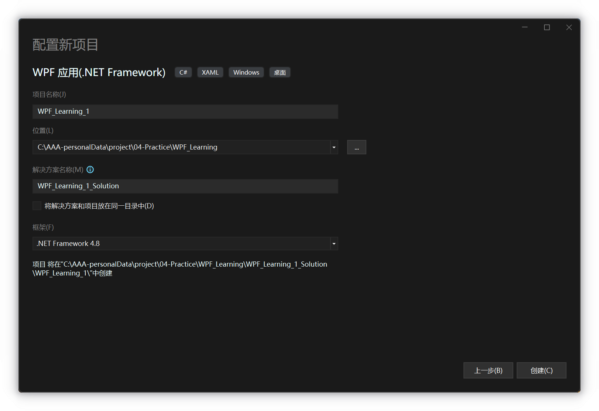
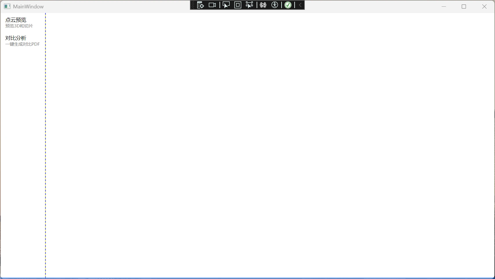

# WPF学习笔记

## 项目文件结构

如此创建项目（即创建一个项目模板）



便会生成如下的项目结构

```sh [powershell]
📂WPF_Learning_1_Solution  
│  📄WPF_Learning_1_Solution.sln                        --> [项目信息] 
│    
└─📂WPF_Learning_1  
	│  📄App.config  
	│  📄App.xaml                                       --> [程序界面入口]
	│  📄App.xaml.cs  
	│  📄MainWindow.xaml                                --> [界面设计文件]
	│  📄MainWindow.xaml.cs                             --> [后端控制函数]
	│  📄WPF_Learning_1.csproj                          --> [项目构建配置文件]
	│    
	├─📂bin  
	│  └─📂Debug  
	├─📂obj  
	│  └─📂Debug  
	│      │  📄.NETFramework,Version=v4.8.AssemblyAttributes.cs  
	│      │  📄App.g.i.cs  
	│      │  📄DesignTimeResolveAssemblyReferencesInput.cache  
	│      │  📄MainWindow.g.i.cs  
	│      │  📄WPF_Learning_1.csproj.AssemblyReference.cache  
	│      │  📄WPF_Learning_1_MarkupCompile.i.cache  
	│      │  📄WPF_Learning_1_MarkupCompile.i.lref  
	│      │    
	│      └─📂TempPE  
	└─📂Properties  
			📄AssemblyInfo.cs  
			📄Resources.Designer.cs  
			📄Resources.resx  
			📄Settings.Designer.cs  
			📄Settings.settings
```

## 简单多页程序示例

### 编写一个最基本的页面跳转

`📄MainWindow.xaml` 

```xml
<Window x:Class="[ProjectName].MainWindow"
        xmlns="http://schemas.microsoft.com/winfx/2006/xaml/presentation"
        xmlns:x="http://schemas.microsoft.com/winfx/2006/xaml"
        xmlns:d="http://schemas.microsoft.com/expression/blend/2008"
        xmlns:mc="http://schemas.openxmlformats.org/markup-compatibility/2006"
        xmlns:local="clr-namespace:[ProjectName]"
        xmlns:pages="clr-namespace:[ProjectName].Views.Pages"
        mc:Ignorable="d"
        Title="MainWindow" Height="450" Width="800">
    <Grid>
        <Grid.ColumnDefinitions>
            <ColumnDefinition Width="3*"/>
            <ColumnDefinition Width="13*"/>
        </Grid.ColumnDefinitions>
        
        <ListBox Name="navMenu" SelectionChanged="ListBox_SelectionChanged">
            <ListBoxItem Content="page1" Tag="{x:Type pages:page1}"/>
            <ListBoxItem Content="page2" Tag="{x:Type pages:page2}"/>
        </ListBox>

        <Frame Grid.Column="1" Name="appFrame" NavigationUIVisibility="Hidden"/>
    </Grid>
</Window>
```

### 两个页面

在项目根目录下新建目录，行程如下目录结构 `📂~/Views/Pages` ，然后新建两个页面

`page1`

```xml
<Page x:Class="[ProjectName].Views.Pages.page1"
      xmlns="http://schemas.microsoft.com/winfx/2006/xaml/presentation"
      xmlns:x="http://schemas.microsoft.com/winfx/2006/xaml"
      xmlns:mc="http://schemas.openxmlformats.org/markup-compatibility/2006" 
      xmlns:d="http://schemas.microsoft.com/expression/blend/2008" 
      xmlns:local="clr-namespace:[ProjectName].Views.Pages"
      mc:Ignorable="d" d:DesignHeight="450" d:DesignWidth="800"
      Title="page1">

    <Grid>
        <Grid MaxWidth="400" Margin="20">
            <StackPanel HorizontalAlignment="Stretch">
                <TextBlock>This is page1</TextBlock>
            </StackPanel>
        </Grid>
    </Grid>
</Page>
```

`page2`

```xml
<Page x:Class="[ProjectName].Views.Pages.page2"
      xmlns="http://schemas.microsoft.com/winfx/2006/xaml/presentation"
      xmlns:x="http://schemas.microsoft.com/winfx/2006/xaml"
      xmlns:mc="http://schemas.openxmlformats.org/markup-compatibility/2006" 
      xmlns:d="http://schemas.microsoft.com/expression/blend/2008" 
      xmlns:local="clr-namespace:[ProjectName].Views.Pages"
      mc:Ignorable="d" d:DesignHeight="450" d:DesignWidth="800"
      Title="page2">

    <Grid>
        <Grid MaxWidth="400" Margin="20">
            <StackPanel HorizontalAlignment="Stretch">
                <TextBlock>This is page2</TextBlock>
            </StackPanel>
        </Grid>
    </Grid>
</Page>
```

现在大致的结构如下：

```shell
📂 [ProjectName]
 ┣ 📂 Views
 ┃  ┗ 📂 Pages
 ┃     ┣ page1.xaml
 ┃     ┗ page2.xaml
 ┣ App.xaml
 ┣ App.xaml.cs
 ┣ MainWindow.xaml
 ┣ MainWindow.xaml.cs
 ┣ ......
```

### 后端跳转逻辑

`MainWindow.xaml.cs`

```cs
public partial class MainWindow : Window
{
    public MainWindow()
    {
        InitializeComponent();
    }

    // 页面实例的缓存
    private static readonly Dictionary<Type, Page> bufferedPages =
        new Dictionary<Type, Page>();

    private void ListBox_SelectionChanged(object sender, SelectionChangedEventArgs e)
    {
        // 如果选择项不是 ListBoxItem, 则返回
        if (navMenu.SelectedItem is not ListBoxItem item)
            return;
	
        // 如果 Tag 不是一个类型, 则返回
        if (item.Tag is not Type type)
            return;

        // 如果页面缓存中找不到页面, 则创建一个新的页面并存入
        if (!bufferedPages.TryGetValue(type, out Page? page))
            page = bufferedPages[type] = 
                Activator.CreateInstance(type) as Page ?? throw new Exception("this would never happen");

        // 使用 Frame 进行导航.
        appFrame.Navigate(page);
    }
}
```

### 加一点美化

在项目根目录下新建 `📂ViewModels` ，在此目录下新建以下文件：

创建一个 `NavigationItem` 用来存放导航数据:

```cs
// NavigationItem.cs
using System;
using System.Collections.Generic;
using System.Linq;
using System.Text;
using System.Threading.Tasks;
using System.Windows.Controls;

namespace [ProjectName].ViewModels
{
	// 定义 Item 实体的属性
    public class NavigationItem
    {
        /// <summary>导航标题</summary>
        public string Title { get; set; } = string.Empty;

        /// <summary>导航描述（次要信息）</summary>
        public string Description { get; set; } = string.Empty;

        /// <summary>目标页面的类型</summary>
        public Type TargetPageType { get; set; } = typeof(Page);
    }
}
```

为 `MainWindow` 创建一个 `MainWindowModel` 用来存放页面数据:

```cs
// MainWindowModel.cs
using System;
using System.Collections.Generic;
using System.Collections.ObjectModel;
using System.Linq;
using System.Text;
using System.Threading.Tasks;
using System.Windows.Controls;

namespace [ProjectName].ViewModels
{
    public class MainWindowViewModel
    {
        public ObservableCollection<NavigationItem> NavigationItems { get; }
            = new ObservableCollection<NavigationItem>
            {
            	// Item 实体声明，内部对应在Navigation.cs中定义的实体属性
                new NavigationItem
                {
                    Title = "page1",
                    Description = "The No.1 page of this application",
                    TargetPageType = typeof(Views.Pages.page1)
                },
                new NavigationItem
                {
                    Title = "page2",
                    Description = "The No.2 page of this application",
                    TargetPageType = typeof(Views.Pages.page2)
                }
            };
    }
}
```

现在目录结构大致如下：

```shell
 📂 [ProjectName]
 ┣ 📂 Views
 ┃  ┗ 📂 Pages
 ┃     ┣ MainPage.xaml
 ┃     ┗ ConfigurationPage.xaml
 ┣ 📂 ViewModels
 ┃  ┣ NavigationItem.cs
 ┃  ┗ MainWindowViewModel.cs
 ┣ App.xaml
 ┣ MainWindow.xaml
 ┣ MainWindow.xaml.cs
 ┣ ......
```

然后修改 `MainWindow.xaml` ：

```xml
<Window x:Class="[ProjectName].MainWindow"
        xmlns="http://schemas.microsoft.com/winfx/2006/xaml/presentation"
        xmlns:x="http://schemas.microsoft.com/winfx/2006/xaml"
        xmlns:d="http://schemas.microsoft.com/expression/blend/2008"
        xmlns:mc="http://schemas.openxmlformats.org/markup-compatibility/2006"
        xmlns:local="clr-namespace:[ProjectName]"
        xmlns:pages="clr-namespace:[ProjectName].Views.Pages"
        xmlns:vm="clr-namespace:[ProjectName].ViewModels" 
        mc:Ignorable="d"
        Title="MainWindow" Height="450" Width="800">
  <Window.DataContext>
    <!--直接在 XAML 中给 Window 的 DataContext 赋值-->
    <vm:MainWndowModel/>
  </Window.DataContext>

  <Grid>
    <Grid.ColumnDefinitions>
      <ColumnDefinition Width="3*"/>
      <ColumnDefinition Width="13*"/>
    </Grid.ColumnDefinitions>

    <!--使用 ListBox, 并且将 ItemsSource 绑定到我们的数据-->
    <!--记得要使用禁用它的水平滚动条-->
    <ListBox Name="navMenu"
             ItemsSource="{Binding NavigationItems}" BorderThickness="0 0 1 0"
             ScrollViewer.HorizontalScrollBarVisibility="Disabled"
             SelectionChanged="navMenu_SelectionChanged">
      <ListBox.ItemTemplate>
        <DataTemplate>
          <Border Padding="5">
            <StackPanel>
              <TextBlock Text="{Binding Title}"/>

              <!--描述信息用灰色字体, 字号也小一点, 多余的部分剪切掉-->
              <TextBlock Text="{Binding Description}" Foreground="Gray"
                         FontSize="10" TextTrimming="CharacterEllipsis"/>
            </StackPanel>
          </Border>
        </DataTemplate>
      </ListBox.ItemTemplate>
    </ListBox>

    <Frame Grid.Column="1" Name="appFrame" NavigationUIVisibility="Hidden"/>
  </Grid>
</Window>
```

后台代码也相应的改一下, 只需要判断数据是否是 `NavigationItem` 就好:

```cs
using System;
using System.Collections.Generic;
using System.Windows;
using System.Windows.Controls;
using System.Windows.Controls.Primitives;
using WpfNavigationTutorial.ViewModels;
using System.Windows.Navigation;
using System.Windows.Controls;

namespace [ProjectName]
{
    public partial class MainWindow : Window
    {
        // 页面实例缓存：Type → Page
        private static readonly Dictionary<Type, Page> bufferedPages
            = new Dictionary<Type, Page>();

        public MainWindow()
        {
            InitializeComponent();
        }

        private void navMenu_SelectionChanged(object sender, SelectionChangedEventArgs e)
        {
            // 1. 获取选中的 NavigationItem
            if (navMenu.SelectedItem is not NavigationItem item)
                return;

            // 2. 目标页面类型
            Type type = item.TargetPageType;

            // 3. 从缓存取或新建
            if (!bufferedPages.TryGetValue(type, out Page? page))
            {
                page = Activator.CreateInstance(type) as Page
                       ?? throw new InvalidOperationException("无法创建页面实例");
                bufferedPages[type] = page;
            }

            // 4. 导航
            appFrame.Navigate(page);
        }
    }
}
```

### 美化后效果预览



## 在 `C#-WPF` 程序中调用 `python`

