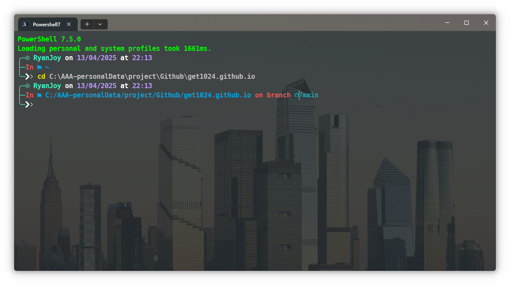
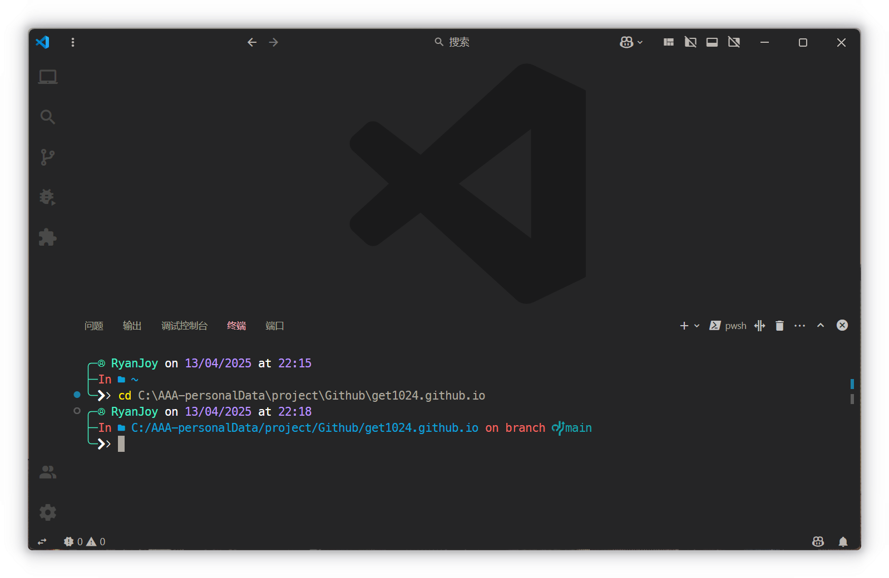

# Powershell配置和美化方案

## 前言

`Terminal` 和 `命令行工具` 相信大家都不陌生，但是作为计算机相关专业的学生/科研人员/工作人员，一定了解到 `Powershell`。

但是原生 `Powershell` 在语法高亮、代码补全、样式美化方面并不能完全满足大家个性化的需求，这里便提出了 `Powershell` 配置和美化方案。

先看配置美化完成的效果

- Windows 终端窗口（有背景是因为终端窗口透明，后面是我的桌面**壁纸**）

- VSCode 自带终端

是不是比原生的好看呢？接下来看看具体如何配置吧！如果你只是想复刻我的样式，请直接跳转这里： [复刻我的配置](#复刻我的配置)

## 安装 Powershell 7

在 `Windows Terminal` (对于 Windows 11 用户) <span class="marker-evy">或</span> `Windows PowerShell` (对于 Windows 10 用户) 中，复制以下命令运行。

```sh [powershell]
winget install --id Microsoft.PowerShell --source winget
```

这样默认是安装在 `C:\` 盘中，我们也推荐如此。如果你实在不想这么做，可以通过追加参数 `-i` 打开交互式安装。

耐心等待后显示安装成功。


如果你有更多需求，请查看官方文档：[在 Windows 上安装 PowerShell](https://learn.microsoft.com/zh-cn/powershell/scripting/install/installing-powershell-on-windows?view=powershell-7.4#install-powershell-using-winget-recommended)

## 配置

### 设置默认

打开 `PowerShell7` 设置页，选择默认打开为 `PowerShell`


### 安装 `Posh-Git`

`PowerShell7` 运行以下命令

```shell [powershell]
Install-Module -Name posh-git -Force
```

### 安装 `Oh-my-posh`

信任 `PSGallery` 库

```sh [powershell]
Set-PSRepository -Name PSGallery -InstallationPolicy Trusted
```

在 `Powershell` 中运行以下命令，耐心等待安装成功

```sh [powershell]
winget install JanDeDobbeleer.OhMyPosh -s winget
```

### 安装字体

```sh [powershell]
oh-my-posh font install meslo
```

安装字体后，您需要配置 `Windows 终端` 才能使用它。这可以通过修改 Windows 终端设置轻松完成（默认快捷方式： `CTRL + SHIFT + ,` ）。在您的 `settings.json` 文件中，在 `profiles` 中的 `defaults` 属性下添加 `font.face` 属性：

```json [setting.json]
{
	"profiles":
	{
		"defaults":
		{
			"font":
			{
				"face": "MesloLGMDZ Nerd Font Mono"
			}
		}
	}
}
```

### 启用 `Oh-my-posh` 主题

在 `Powershell` 中运行，显示所有预设主题，挑选你喜欢的主题。

```sh [powershell]
Get-PoshThemes
```


如果你觉得终端观看各种主题不太清楚，可以到官方文档 [Themes | Oh My Posh](https://ohmyposh.dev/docs/themes) 查看。

::: details 运行 `Get-PoshThemes` 报错？

报错显示如下

```sh [powershell]
╭─ RyanJoy 19/05/2025 08:37
├─In  ~
╰─ Get-PoshThemes
Get-PoshThemes: The term 'Get-PoshThemes' is not recognized as a name of a cmdlet, function, script file, or executable program. Check the spelling of the name, or if a path was included, verify that the path is correct and try again.
```

有可能是 `oh-my-posh` 未能安装成功，运行以下命令进行验证

```sh [powershell]
Get-Module -ListAvailable -Name oh-my-posh
```

如果安装失败，则没有输出；如果安装成功，则输出如下

```sh [powershell]
╭─ RyanJoy 19/05/2025 16:59
├─In  ~
╰─ Get-Module -ListAvailable -Name oh-my-posh

    Directory: C:\Users\RyanJoy\Documents\PowerShell\Modules

ModuleType Version PreRelease    Name    PSEdition ExportedCommands
---------- ------- ---------- ---------- --------- ----------------
  Script   7.85.2             oh-my-posh    Desk    Set-PoshPrompt
``` 

如果安装失败，则请你重新安装。安装完毕后，重试 `Get-PoshThemes` 命令进行验证。

如果你还有任何问题，欢迎评论指出。

:::

挑选你喜欢的主题，并记住主题名字，这里我们以 `neko` 为例。

终端运行：

```sh [powershell]
code $profile
```

在弹出窗口添加配置：

```ps1 [Microsoft.PowerShell_profile.ps1]
oh-my-posh init pwsh --config "$env:POSH_THEMES_PATH/neko.omp.json" | Invoke-Expression
```

重新返回终端便可查看主题已经变为 `neko` 对应主题，设置其他主题也同理。

如果你对配置教程有更加深刻的需求，请访问官方文档 [Introduction \| Oh My Posh](https://ohmyposh.dev/docs)。

## 复刻我的配置

这里提供几个关键文件，只要你配置完全了一下三个文件，那么就能得到我的样式效果了。

::: code-group

```ps1 [Microsoft.PowerShell_profile.ps1]
# 引入 gsudo
Import-Module gsudoModule
# 引入 posh-git
Import-Module posh-git
# 引入 ps-read-line
Import-Module PSReadLine
# 退出时保存历史
Set-PSReadLineOption -HistorySaveStyle SaveAtExit
# 设置预测文本来源为历史记录
Set-PSReadLineOption -PredictionSource History
# 每次回溯输入历史，光标定位于输入内容末尾
Set-PSReadLineOption -HistorySearchCursorMovesToEnd
# 设置预测文本的展示样式为列表视图（另一选择：InlineView）
Set-PSReadLineOption -PredictionViewStyle ListView
# 禁用命令行输入时的铃声提醒，并改为光标提醒
Set-PSReadLineOption -BellStyle Visual
## 设置 Tab 键补全
Set-PSReadlineKeyHandler -Key Tab -Function Complete
## 设置 Ctrl+D 为菜单补全和 Intellisense
Set-PSReadLineKeyHandler -Key "Ctrl+d" -Function MenuComplete
## 设置 Ctrl+Z 为撤销
Set-PSReadLineKeyHandler -Key "Ctrl+z" -Function Undo
## 设置向上键为后向搜索历史记录
Set-PSReadLineKeyHandler -Key UpArrow -Function HistorySearchBackward
## 设置向下键为前向搜索历史记录
Set-PSReadLineKeyHandler -Key DownArrow -Function HistorySearchForward

# 引入 scoop-search
Invoke-Expression (&scoop-search --hook)

oh-my-posh init pwsh | Invoke-Expression

oh-my-posh init pwsh --config 'C:\Users\RyanJoy\AppData\Local\Programs\oh-my-posh\themes\ryanjoy.omp.json' | Invoke-Expression
```

```json [ryanjoy.omp.json]
// C:\Users\RyanJoy\AppData\Local\Programs\oh-my-posh\themes\ryanjoy.omp.json
{
  "$schema": "https://raw.githubusercontent.com/JanDeDobbeleer/oh-my-posh/main/themes/schema.json",
  "blocks": [
    {
      "alignment": "left",
      "segments": [
        {
          "foreground": "#45F1C2",
          "style": "plain",
          "template": "\u256d\u2500",
          "type": "text"
        },
        {
          "foreground": "#45F1C2",
          "style": "plain",
          "template": "\ueb99 RyanJoy",
          "type": "session"
        },
        {
          "foreground": "#bc93ff",
          "properties": {
            "time_format": "02/01/2006 15:04"
          },
          "style": "diamond",
          "template": " {{ .CurrentDate | date .Format }} ",
          "type": "time"
        },
        {
          "foreground": "#98C379",
          "properties": {
            "fetch_version": true
          },
          "style": "plain",
          "template": "<#ffffff>via</> \ue781 {{ if .PackageManagerIcon }}{{ .PackageManagerIcon }} {{ end }}{{ .Full }} ",
          "type": "node"
        }
      ],
      "type": "prompt"
    },
    {
      "alignment": "left",
      "newline": true,
      "segments": [
        {
          "foreground": "#45F1C2",
          "style": "plain",
          "template": "\u251c\u2500",
          "type": "text"
        },
        {
          "foreground": "#0CA0D8",
          "properties": {
            "folder_separator_icon": "/",
            "style": "full"
          },
          "style": "plain",
          "template": "<#f62f2e>In</> \uf07b {{ .Path }} ",
          "type": "path"
        },
        {
          "foreground": "#F62F2E",
          "properties": {
            "fetch_status": true
          },
          "style": "plain",
          "template": "<#ffffff>on</> {{ .HEAD }}{{if .BranchStatus }} {{ .BranchStatus }}{{ end }}{{ if .Working.Changed }} \uf044 {{ .Working.String }}{{ end }}{{ if and (.Working.Changed) (.Staging.Changed) }} |{{ end }}{{ if .Staging.Changed }} \uf046 {{ .Staging.String }}{{ end }} ",
          "type": "git"
        }
      ],
      "type": "prompt"
    },
    {
      "alignment": "left",
      "newline": true,
      "segments": [
        {
          "foreground": "#45F1C2",
          "style": "plain",
          "template": "\u2570\u2500",
          "type": "text"
        },
        {
          "foreground": "#ffffff",
          "foreground_templates": ["{{ if gt .Code 0 }}#ef5350{{ end }}"],
          "properties": {
            "always_enabled": true
          },
          "style": "plain",
          "template": "\ue285\ueab6 ",
          "type": "status"
        }
      ],
      "type": "prompt"
    }
  ],
  "version": 3
}

```

```json [setting.json]
// ctrl+Shift+,
{
    "$help": "https://aka.ms/terminal-documentation",
    "$schema": "https://aka.ms/terminal-profiles-schema",
    "actions": 
    [
        {
            "command": "paste",
            "id": "User.paste"
        },
        {
            "command": 
            {
                "action": "copy",
                "singleLine": false
            },
            "id": "User.copy.644BA8F2"
        },
        {
            "command": "find",
            "id": "User.find"
        },
        {
            "command": 
            {
                "action": "splitPane",
                "split": "auto",
                "splitMode": "duplicate"
            },
            "id": "User.splitPane.A6751878"
        }
    ],
    "alwaysShowTabs": true,
    "centerOnLaunch": true,
    "copyFormatting": "none",
    "copyOnSelect": false,
    "defaultInputScope": "alphanumericHalfWidth",
    "defaultProfile": "{18413164-90ab-4dbd-8011-8a1c2c70638b}",
    "focusFollowMouse": true,
    "initialCols": 120,
    "initialRows": 25,
    "keybindings": 
    [
        {
            "id": "User.paste",
            "keys": "ctrl+v"
        },
        {
            "id": "User.find",
            "keys": "ctrl+shift+f"
        },
        {
            "id": "User.copy.644BA8F2",
            "keys": "ctrl+c"
        },
        {
            "id": "User.splitPane.A6751878",
            "keys": "alt+shift+d"
        }
    ],
    "language": "zh-Hans",
    "launchMode": "default",
    "newTabMenu": 
    [
        {
            "type": "remainingProfiles"
        }
    ],
    "profiles": 
    {
        "defaults": 
        {
            "colorScheme": "Homebrew",
            "experimental.retroTerminalEffect": false,
            "font": 
            {
                "face": "Maple Mono NF",
                "size": 11
            },
            "intenseTextStyle": "all",
            "opacity": 55,
            "scrollbarState": "hidden",
            "startingDirectory": "%USERPROFILE%",
            "useAcrylic": true
        },
        "list": 
        [
            {
                "font": 
                {
                    "face": "Maple Mono NF"
                },
                "guid": "{61c54bbd-c2c6-5271-96e7-009a87ff44bf}",
                "hidden": false,
                "name": "Windows PowerShell"
            },
            {
                "adjustIndistinguishableColors": "indexed",
                "colorScheme": "Homebrew",
                "elevate": true,
                "font": 
                {
                    "face": "Maple Mono NF",
                    "size": 12
                },
                "guid": "{0caa0dad-35be-5f56-a8ff-afceeeaa6101}",
                "hidden": false,
                "name": "\u547d\u4ee4\u63d0\u793a\u7b26",
                "opacity": 42
            },
            {
                "guid": "{b453ae62-4e3d-5e58-b989-0a998ec441b8}",
                "hidden": false,
                "name": "Azure Cloud Shell",
                "source": "Windows.Terminal.Azure"
            },
            {
                "guid": "{16208362-94fc-5b1f-a491-5b2624d5ab56}",
                "hidden": true,
                "name": "Visual Studio Debug Console",
                "source": "VSDebugConsole"
            },
            {
                "adjustIndistinguishableColors": "never",
                "antialiasingMode": "cleartype",
                "backgroundImage": null,
                "backgroundImageOpacity": 0.49,
                "backgroundImageStretchMode": "none",
                "colorScheme": "Homebrew",
                "commandline": "C:\\Program Files\\PowerShell\\7\\pwsh.exe",
                "font": 
                {
                    "face": "Maple Mono NF",
                    "size": 12,
                    "weight": "semi-bold"
                },
                "guid": "{18413164-90ab-4dbd-8011-8a1c2c70638b}",
                "hidden": false,
                "icon": "C:\\Program Files\\PowerShell\\7\\assets\\Powershell_black.ico",
                "name": "Powershell7",
                "opacity": 86,
                "scrollbarState": "hidden",
                "showMarksOnScrollbar": true,
                "tabTitle": "Powershell7",
                "useAcrylic": false
            },
            {
                "guid": "{ef5c7d21-e0a2-5776-9987-ed368b38b44f}",
                "hidden": false,
                "name": "Developer Command Prompt for VS 2022",
                "source": "Windows.Terminal.VisualStudio"
            },
            {
                "guid": "{da43095e-0669-5d9a-a948-06375d22d682}",
                "hidden": false,
                "name": "Developer PowerShell for VS 2022",
                "source": "Windows.Terminal.VisualStudio"
            },
            {
                "guid": "{769f29cc-21d2-5a0d-b15d-94f7c33ac61c}",
                "hidden": false,
                "name": "Developer Command Prompt for VS 2017",
                "source": "Windows.Terminal.VisualStudio"
            },
            {
                "guid": "{a02ebe16-e418-556a-9374-a9648db16121}",
                "hidden": false,
                "name": "Developer Command Prompt for VS 2022",
                "source": "Windows.Terminal.VisualStudio"
            },
            {
                "guid": "{a39e88b9-3366-5e71-b9c0-500a08ac333f}",
                "hidden": false,
                "name": "Developer PowerShell for VS 2022",
                "source": "Windows.Terminal.VisualStudio"
            }
        ]
    },
    "schemes": 
    [
        {
            "background": "#283033",
            "black": "#000000",
            "blue": "#6666E9",
            "brightBlack": "#666666",
            "brightBlue": "#0000FF",
            "brightCyan": "#00E5E5",
            "brightGreen": "#00D900",
            "brightPurple": "#E500E5",
            "brightRed": "#E50000",
            "brightWhite": "#E5E5E5",
            "brightYellow": "#E5E500",
            "cursorColor": "#FFFFFF",
            "cyan": "#00A6B2",
            "foreground": "#00FF00",
            "green": "#00A600",
            "name": "Homebrew",
            "purple": "#B200B2",
            "red": "#FC5275",
            "selectionBackground": "#FFFFFF",
            "white": "#BFBFBF",
            "yellow": "#999900"
        },
        {
            "background": "#283033",
            "black": "#000000",
            "blue": "#6666E9",
            "brightBlack": "#666666",
            "brightBlue": "#0E5CEE",
            "brightCyan": "#00E5E5",
            "brightGreen": "#00D900",
            "brightPurple": "#E500E5",
            "brightRed": "#E50000",
            "brightWhite": "#E5E5E5",
            "brightYellow": "#E5E500",
            "cursorColor": "#FFFFFF",
            "cyan": "#00A6B2",
            "foreground": "#00FF00",
            "green": "#00A600",
            "name": "HomebrewCus",
            "purple": "#B200B2",
            "red": "#FC5275",
            "selectionBackground": "#FFFFFF",
            "white": "#BFBFBF",
            "yellow": "#999900"
        }
    ],
    "tabWidthMode": "titleLength",
    "theme": "dark",
    "themes": [],
    "useAcrylicInTabRow": true
}
```

:::