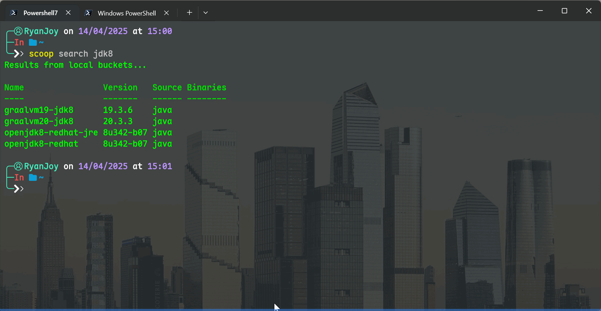

# Scoop —— Windows下的包管理器

## 安装与配置

::: tip 作者说
如果你没有安装 `powershell` ，请先移步 [1-Powershell配置和美化方案](../📟Powershell/1-Powershell配置和美化方案.md)
:::

### Scoop 安装

- PowerShell 的 [语言模式](https://learn.microsoft.com/zh-cn/powershell/module/microsoft.powershell.core/about/about_language_modes) 必须设置为 `FullLanguage`，以运行安装程序和 Scoop。

- PowerShell 的 [执行策略](https://learn.microsoft.com/zh-cn/powershell/module/microsoft.powershell.core/about/about_execution_policies) 必须设置为 `RemoteSigned`、`Unrestricted` 或 `ByPass` 之一，以运行安装程序。例如，可以通过以下命令将其设置为 `RemoteSigned`：

```powershell [powershell]
Set-ExecutionPolicy -ExecutionPolicy RemoteSigned -Scope CurrentUser
```

将 Scoop 安装到自定义目录，配置 Scoop 将全局程序安装到自定义目录，并在安装过程中绕过系统代理：

```powershell [powershell]
irm https://get.scoop.sh -OutFile install.ps1
.\install.ps1 -ScoopDir '[自定义路径]' -ScoopGlobalDir '[自定义路径]' -NoProxy
## 比如
## .\install.ps1 -ScoopDir 'C:\AAA-applications\Scoop' -ScoopGlobalDir 'C:\AAA-applications\Scoop_Global' -NoProxy
```

### 配置代理

在 `powershell` 复制一下内容并执行

::: tip 作者说

- 若您没有安装 `Git` ，请见 [Git安装配置](../../🖥️专业技能/🌵Git/Git安装配置.md) ;
- 我本地使用的 `clash` 代理，所以端口是 `7897`
:::

```sh [powershell]
scoop config proxy 127.0.0.1:7897
git config --global http.proxy http://127.0.0.1:7897
git config --global https.proxy https://127.0.0.1:7897
```

### aira 2 配置

使用 `aira2` 进行下载加速

```sh [powersehll]
scoop install main/aria2
scoop config aria2-enabled true
```

以下载 `openjdk8` 做演示



至此，基本完成了 `scoop` 的安装配置，你可以开始你的使用了！

## 常用软件和 `bucket`

## 常见错误解决